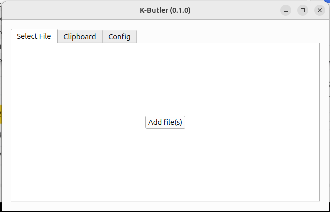

# Concepts

K-Butler is a modular application that allows the user to process files, or your clipboard, in various ways.

The capabilities depends on the modules enabled.

## Welcome screen

The welcome screen is displayed when the application starts.
It shows the current version of the application, and 3 tabs as in the following picture:

- Select File Tab: This is the default tab. The user can click and select one or multiple files to be processed. Alternatively, the user can drag and drop files directly into the application window.
- Clipboard Tab: This tab allows the user to paste the current content of the clipboard into the application.
- Config Tab: This tab allows the user to configure the application based on the enabled modules.
